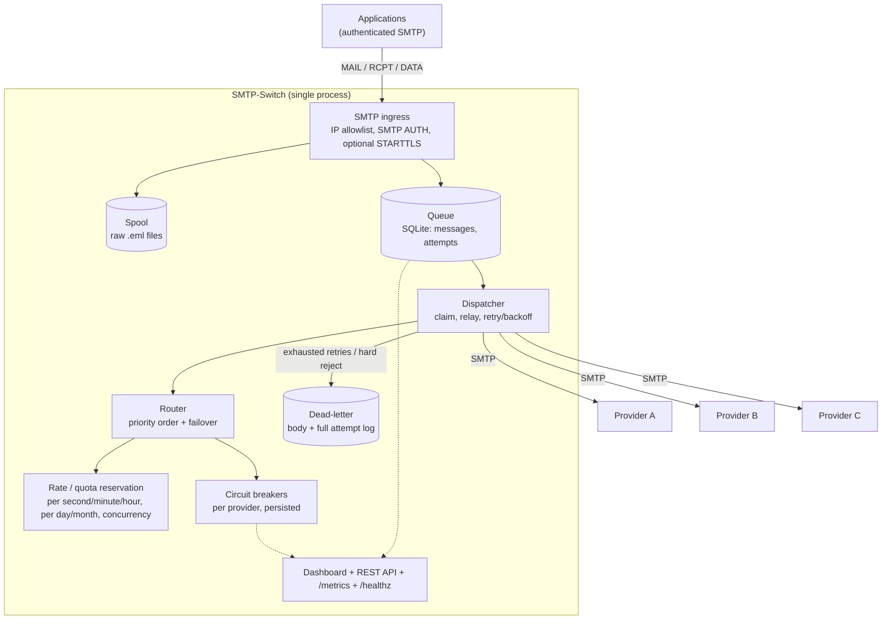
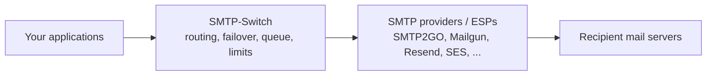

# SMTP-Switch

[](https://github.com/saderi/SMTP-Switch/actions/workflows/ci.yml)
[](LICENSE)
[](pyproject.toml)
[](#current-project-status)

**SMTP-Switch is a self-hosted SMTP gateway that relays outbound email across multiple providers with health-aware failover, quota- and rate-aware routing, a durable on-disk queue, retry/backoff, and Prometheus metrics.**

Your applications keep speaking ordinary authenticated SMTP. SMTP-Switch accepts the
message, stores it durably, and relays it through the best eligible upstream provider
(SMTP2GO, Mailgun, Resend, Postmark, Amazon SES SMTP, a corporate smarthost — anything
that speaks SMTP). If the preferred provider is unhealthy or would exceed one of its
configured limits, the message is routed to the next one. If nothing has capacity right
now, the message waits in the queue and is retried rather than dropped.

The mental model is roughly **"HAProxy for outbound SMTP providers"**: one stable
submission endpoint in front of a pool of interchangeable upstreams, with the routing,
retrying and rate-limiting handled centrally instead of in every application.

---

## Contents

- [Architecture](#architecture)
- [Why SMTP-Switch?](#why-smtp-switch)
- [Key features](#key-features)
- [Quick start](#quick-start)
- [Configuration](#configuration)
- [Routing and failover behavior](#routing-and-failover-behavior)
- [A failure, step by step](#a-failure-step-by-step)
- [Observability](#observability)
- [Deployment](#deployment)
- [Security considerations](#security-considerations)
- [When should I use this?](#when-should-i-use-this)
- [When should I *not* use this?](#when-should-i-not-use-this)
- [Where this sits in the ecosystem](#where-this-sits-in-the-ecosystem)
- [Current project status](#current-project-status)
- [Roadmap](#roadmap)
- [Contributing](#contributing)

---

## Architecture

Single asyncio process. Inbound mail is handled by [`aiosmtpd`](https://aiosmtpd.readthedocs.io/);
outbound relay uses [`aiosmtplib`](https://aiosmtplib.readthedocs.io/). State lives in
SQLite; message bodies live as files in a spool directory.



| Stage | Behavior |
|---|---|
| **Ingress** | `aiosmtpd` server on port `2525`. Enforces a source-IP allowlist (CIDR), SMTP AUTH (per-service accounts, argon2-hashed), and optional STARTTLS. Each accepted message is written to a spool file plus a `messages` row, then answered `250 ... queued as <id>`. |
| **Queue** | SQLite. One producer task claims due messages (`queued → sending`) in batches; a pool of workers relays them. `sending` rows left behind by a crash are reset to `queued` on startup. |
| **Routing** | Providers are tried in ascending `priority`. A provider is skipped if its circuit breaker is open, or if a reservation against its rate/quota limits fails. The first provider that grants a reservation is used. |
| **Rate / quota** | Per provider: sliding windows (`per_second` / `per_minute` / `per_hour`), fixed period counters (`per_day` / `per_month`, with a configurable monthly reset day), and `max_concurrent`. The reservation is taken **before** the outbound connection, so concurrent workers cannot overshoot a limit. |
| **Health** | One circuit breaker per provider: `failure_threshold` consecutive failures open it for `cooldown_seconds`, then a half-open probe closes it on success or re-opens it on failure. Breaker state is written to SQLite so a restart does not forget an ongoing outage. |
| **Retry** | Roughly exponential backoff with jitter between `base_delay_seconds` and `max_delay_seconds`, bounded by `max_attempts` and `max_age_hours`. "No provider has capacity right now" uses a short fixed hold and does **not** consume a retry attempt. |
| **Dead-letter** | Messages that exhaust retries, age out, or are rejected `5xx` by every provider move to `deadletter`, keeping their body and full per-attempt history. Requeue or download from the dashboard/API. |
| **Observability** | Structured JSON logs, Prometheus metrics at `/metrics`, a REST API under `/api`, a `/healthz` endpoint, and a small server-rendered dashboard on port `8080`. |

---

## Why SMTP-Switch?

Concrete situations it is built for:

- **Primary provider outage.** Your ESP has a bad hour. Without a fallback, mail
  queues in each application (or is lost). SMTP-Switch's circuit breaker trips after
  a few failures and routes new mail to a secondary provider automatically; it
  probes the primary again after a cooldown.
- **Transient `4xx` responses.** A provider returns `451`/`421` under load.
  SMTP-Switch retries with backoff and, within the same dispatch cycle, can fail the
  message over to another provider instead of parking it.
- **Monthly quota exhaustion.** You are on a 100k/month plan and hit it on the 27th.
  Instead of hard-failing, SMTP-Switch stops selecting that provider and sends
  through the next one. The monthly counter can be aligned to your plan's billing
  day rather than the calendar 1st.
- **Per-second / per-minute rate limits.** Providers cap submission rate. SMTP-Switch
  enforces your configured rate limits locally, before dialing out, so you get
  smooth spillover to other providers instead of provider-side throttling errors.
- **No per-provider integration in applications.** Applications target one SMTP
  endpoint. Adding, removing, or reordering providers is a config change on
  SMTP-Switch, not a deploy of every service.
- **Migrating providers with zero application changes.** Add the new provider at a
  better priority, watch traffic shift on the dashboard, then remove the old one.
- **Centralized SMTP credentials and routing.** Provider API keys live in one place
  with one rotation procedure, instead of scattered across application secrets.
- **Outbound-email observability.** One place to see queue depth, per-provider
  send/fail counts, remaining quota headroom, relay latency, and dead letters —
  as Prometheus metrics and on a dashboard.

Applications continue to speak normal SMTP. There is no SDK and no proprietary API
to adopt.

---

## Key features

Everything in this list is implemented and covered by tests.

**Routing and delivery**

- Multiple SMTP upstreams, configured as plain host/port/credentials.
- Strict priority ordering with failover to the next eligible provider.
- In-cycle failover: a single message can try several providers in one dispatch tick
  (`failover_per_tick`).
- Store-and-forward: every message is spooled to disk and recorded in SQLite before
  it is acknowledged to the sender.
- Durable retry queue with roughly-exponential, jittered backoff; bounded by attempt
  count and message age.
- Dead-letter state that retains the message body and the full per-attempt log;
  requeue or download as `.eml`.
- Crash recovery: in-flight (`sending`) messages are re-queued on startup.
- Graceful shutdown on `SIGINT`/`SIGTERM`; in-flight messages are returned to the
  queue.

**Provider protection**

- Per-provider circuit breaker (closed / open / half-open), persisted across restarts.
- Rate limiting per provider across several windows: `per_second`, `per_minute`,
  `per_hour` (sliding), `per_day`, `per_month` (fixed period), and `max_concurrent`.
- `month_reset_day` to align the monthly quota window with a provider's billing anchor.
- Reservations are taken before the outbound connection, so parallel workers cannot
  collectively exceed a limit.
- Ambiguous-timeout policy favors *never exceeding a provider's limit* over *never
  duplicating*: if a relay times out after `DATA`, the send is counted.

**Ingress control**

- SMTP AUTH with per-sending-service accounts (argon2id password hashes).
- Source-IP allowlist (CIDR).
- Optional STARTTLS, with an option to require it before AUTH.
- Configurable maximum message size and `SMTPUTF8` support.

**Operations**

- Prometheus metrics at `/metrics` (queue depth, per-provider health, headroom,
  in-flight, send/fail/dead-letter counters, dispatch and relay latency histograms).
- `/healthz` endpoint (also used as the container `HEALTHCHECK`).
- Structured JSON logs (`structlog`); switchable to human-readable console output.
- Server-rendered dashboard: queue overview, per-provider state with live limit
  bars, message list with search/filter, per-message attempt history.
- REST API under `/api` for the same operations (list/inspect/requeue/delete
  messages, enable/disable a provider, reset a breaker, manage sending accounts).
- Live provider enable/disable from the dashboard, stored in the database so it
  survives a restart without editing config.
- `smtp-switch-admin` CLI for headless bootstrap of dashboard logins and sending
  accounts.
- Retention sweep that deletes old `sent` and `deadletter` messages (and their
  spool files) on a configurable schedule.
- Single-file Docker image; Docker Compose example for a single node.

---

## Quick start

You need Docker with the Compose plugin. This brings up one SMTP-Switch node with a
SQLite database in a named volume.

```bash
git clone https://github.com/saderi/SMTP-Switch.git
cd SMTP-Switch

# 1. Provider list and settings. Edit in your SMTP credentials + allowed_ips.
cp config.example.yaml config.yaml
$EDITOR config.yaml

# 2. The one required secret: the dashboard session-cookie key.
cp .env.example .env
$EDITOR .env        # set SMTP_SWITCH_WEB__SESSION_SECRET

# 3. Start it.
docker compose up -d

# 4. Create a dashboard login and a sending credential for one application.
docker compose exec smtp-switch smtp-switch-admin user add admin --generate
docker compose exec smtp-switch smtp-switch-admin account add app1 --generate
```

Both commands print a generated password once. Then:

| What | Where |
|---|---|
| SMTP submission endpoint for your applications | `localhost:2525` (SMTP AUTH with the `app1` credential) |
| Dashboard | `http://localhost:8080` (bound to `127.0.0.1` by the Compose file) |
| REST API + OpenAPI docs | `http://localhost:8080/api` and `/api/docs` |
| Prometheus metrics | `http://localhost:8080/metrics` |
| Health check | `http://localhost:8080/healthz` |

### Send a test message

With [`swaks`](https://github.com/jetmore/swaks):

```bash
swaks --server localhost:2525 \
  --auth LOGIN --auth-user app1 --auth-password '<generated-password>' \
  --from 'noreply@yourdomain.example' --to 'you@example.com' \
  --header 'Subject: SMTP-Switch test'
```

The shipped `config.example.yaml` leaves ingress STARTTLS off so this works without
certificates. **Turn TLS on before any non-localhost use** — see
[Security considerations](#security-considerations).

Watch the message move `queued → sending → sent` on the dashboard's **Messages** page,
and see which provider carried it under **Provider used**.

### Run from source instead

```bash
python -m venv .venv && . .venv/bin/activate
pip install -e ".[dev]"

cp config.example.yaml config.yaml
$EDITOR config.yaml        # provider credentials; set web.session_secret

smtp-switch-admin user add admin --generate
smtp-switch-admin account add app1 --generate

smtp-switch -c config.yaml
```

---

## Configuration

Configuration is a single YAML file. Its path comes from `SMTP_SWITCH_CONFIG`
(default `config.yaml` in the working directory). `config.example.yaml` is a
complete, annotated sample.

Any scalar can be overridden by an environment variable named
`SMTP_SWITCH_<SECTION>__<KEY>` (double underscore = one level of nesting), which is
how the container injects secrets:

```bash
SMTP_SWITCH_WEB__SESSION_SECRET=...        # -> web.session_secret
SMTP_SWITCH_DATABASE__URL=...              # -> database.url
SMTP_SWITCH_INGRESS__REQUIRE_AUTH=false    # -> ingress.require_auth
```

The **provider list is a list**, so it must come from the YAML file, not the
environment. The application does not read a `.env` file itself; `.env` is only used
by Docker Compose for `${VAR}` interpolation, which then reaches the container as
real environment variables.

### A realistic multi-provider configuration

```yaml
ingress:
  host: 0.0.0.0
  port: 2525
  hostname: smtp-switch.internal
  require_auth: true
  allowed_ips:
    - "127.0.0.1/32"
    - "10.0.0.0/8"            # your application subnet
  tls:
    cert_file: /data/certs/fullchain.pem
    key_file: /data/certs/privkey.pem
    require_starttls: true

dispatch:
  workers: 4
  failover_per_tick: 3        # providers a message may try in one dispatch cycle
  no_capacity_backoff_seconds: 20
  retry:
    base_delay_seconds: 30
    max_delay_seconds: 3600
    max_attempts: 12
    max_age_hours: 48
    jitter_ratio: 0.2

circuit_breaker:
  failure_threshold: 5        # consecutive failures before the breaker opens
  cooldown_seconds: 120       # time open before a half-open probe
  half_open_max_probes: 1

providers:
  - name: smtp2go             # [a-z0-9] then [a-z0-9_-]
    enabled: true
    priority: 10              # lower number = tried first
    smtp:
      host: mail.smtp2go.com
      port: 587
      starttls: true
      username: "${SMTP2GO_USER}"
      password: "${SMTP2GO_PASS}"
      timeout_seconds: 30
    limits:
      max_concurrent: 10
      per_second: 10
      per_minute: 300
      per_day: 10000
      per_month: 200000
      month_reset_day: 1      # your plan's billing anchor day (1..28)

  - name: mailgun
    enabled: true
    priority: 20              # only used when smtp2go is unhealthy or capped
    smtp:
      host: smtp.mailgun.org
      port: 587
      starttls: true
      username: "postmaster@mg.example.com"
      password: "${MAILGUN_PASS}"
    limits:
      max_concurrent: 5
      per_second: 5
      per_month: 50000
      month_reset_day: 1

  - name: ses
    enabled: true
    priority: 30
    smtp:
      host: email-smtp.eu-west-1.amazonaws.com
      port: 587
      starttls: true
      username: "${SES_SMTP_USER}"
      password: "${SES_SMTP_PASS}"

web:
  host: 127.0.0.1
  port: 8080
  session_secret: "${SMTP_SWITCH_WEB__SESSION_SECRET}"
  session_ttl_seconds: 86400

database:
  url: sqlite+aiosqlite:////data/smtp_switch.db
  auto_create: true          # false if you manage the schema with Alembic

logging:
  level: INFO
  json: true

metrics:
  enabled: true
```

Every `limits` field is optional; omit one (or set it `null`) for "no cap on that
window". `starttls: true` uses submission-style STARTTLS on port 587; set `tls: true`
instead for implicit TLS on port 465.

---

## Routing and failover behavior

For each queued message the dispatcher performs up to `failover_per_tick` attempts in
one cycle. Each attempt:

1. **Candidate order.** Providers that are `enabled` (config value, unless a live
   dashboard override says otherwise), sorted by `priority` ascending, then by name.
   Providers already tried for this message in this cycle are excluded.
2. **Health gate.** Skip any provider whose circuit breaker is `open`. A breaker in
   `half-open` admits only `half_open_max_probes` messages at a time.
3. **Capacity gate.** Attempt a reservation against that provider's limits — every
   configured window (`per_second`/`per_minute`/`per_hour`), the day and month
   counters, and `max_concurrent`. If any is at its limit, skip the provider.
4. **Relay.** The first provider that passes all gates gets the message over SMTP.
   The relay outcome is classified:

   | Outcome | Meaning | Reservation | Circuit breaker | Next |
   |---|---|---|---|---|
   | `sent` (`2xx`) | Accepted | committed (counts against quota) | success | done |
   | `connect_error` | DNS / TCP / TLS failure, or disconnect before a reply | released (does **not** count) | failure | try next provider |
   | `transient` (`4xx`, timeout after `DATA`, auth failure) | Provider reachable, not accepted now | committed | failure | try next provider |
   | `permanent` (`5xx`) | Message itself rejected | committed | **success** (provider is healthy) | try next provider |

When the cycle ends without a `sent`:

- **No provider was eligible at all** (every one down, capped, or excluded): the
  message is held for `no_capacity_backoff_seconds` and **no attempt is charged**. It
  stays `queued`. It is never dead-lettered purely for lack of capacity.
- **Every provider returned a permanent `5xx`** (and all candidates were tried): the
  message is dead-lettered with reason `rejected`.
- **The attempt counter would reach `max_attempts`**: dead-lettered, reason
  `max_attempts`.
- **The next backoff would land past `received_at + max_age_hours`**: dead-lettered,
  reason `expired`.
- Otherwise the message is rescheduled with a jittered, roughly-exponential backoff
  (`base_delay_seconds` doubling per attempt, capped near `max_delay_seconds`), and
  the attempt counter is incremented.

Two more dead-letter reasons are checked before relaying: `spool_missing` (the body
file is gone) and `expired` (the message is already older than `max_age_hours`).

The circuit breaker: `failure_threshold` consecutive `connect_error`/`transient`
outcomes move a provider from `closed` to `open`. It stays `open` for
`cooldown_seconds`, then becomes `half-open`; a single successful probe returns it to
`closed`, a failed probe re-opens it and restarts the cooldown. Breaker state is
persisted per provider, so an outage in progress is remembered across a restart. You
can force a breaker closed with **Reset breaker** on the Providers page (or
`POST /api/providers/<name>/reset-breaker`).

---

## A failure, step by step

Two providers: `primary` (priority 10) and `backup` (priority 20).
`circuit_breaker.failure_threshold = 5`.

```
1.  app1 submits a message over authenticated SMTP to :2525.
2.  SMTP-Switch spools the body, writes a `queued` row, answers "250 queued as 4213".
3.  Dispatcher claims message 4213. Router picks `primary` (priority 10, breaker
    closed, quota available) and reserves a slot.
4.  Relay to `primary` fails with "421 4.7.0 try again later" -> classified
    `transient`. Reservation committed; breaker failure #1..#5 recorded across this
    and prior messages.
5.  Same cycle: router excludes `primary`, picks `backup`, reserves a slot.
6.  Relay to `backup` returns "250 OK" -> classified `sent`. Reservation committed,
    breaker for `backup` recorded as success.
7.  Message 4213 is marked `sent`, `provider_used = backup`. Both attempts are in
    its delivery-attempt log.
8.  `primary` has now hit 5 consecutive failures: its breaker opens for 120s. New
    messages skip it entirely and go straight to `backup`.
9.  After 120s the breaker goes half-open. The next message is sent to `primary` as
    a probe; it succeeds, the breaker closes, and `primary` is preferred again.
```

If `backup` had also failed and no other provider were eligible, message 4213 would
have stayed `queued` and been retried later with backoff — not dead-lettered — because
"nothing had capacity" does not burn an attempt.

---

## Observability

### Prometheus metrics

`GET /metrics` (plain text, no auth; returns `404` if `metrics.enabled: false`).

| Metric | Type | Labels | Meaning |
|---|---|---|---|
| `smtp_switch_messages_received_total` | counter | `account` | Messages accepted on the ingress server |
| `smtp_switch_messages_sent_total` | counter | `provider` | Messages relayed successfully |
| `smtp_switch_messages_failed_total` | counter | `provider`, `result` | Delivery attempts that did not succeed (`result` = `transient` / `permanent` / `connect_error`) |
| `smtp_switch_messages_deadlettered_total` | counter | `reason` | Messages moved to `deadletter` (`reason` = `rejected` / `max_attempts` / `expired` / `spool_missing`) |
| `smtp_switch_dispatch_latency_seconds` | histogram | — | Claim → terminal outcome |
| `smtp_switch_provider_relay_seconds` | histogram | `provider` | Time in the outbound SMTP conversation |
| `smtp_switch_queue_depth` | gauge | `status` | Messages per non-terminal status (`queued` / `sending`) plus `sent` / `deadletter` |
| `smtp_switch_provider_healthy` | gauge | `provider` | `1` if the breaker is closed, else `0` |
| `smtp_switch_provider_headroom` | gauge | `provider`, `window` | Remaining sends before a given window's limit |
| `smtp_switch_provider_inflight` | gauge | `provider` | Reserved-but-not-released sends right now |

Gauges are refreshed by a background task every 60 seconds.

**Signals worth alerting on:**

- `smtp_switch_queue_depth{status="queued"}` rising steadily → every provider is
  capped or down.
- `smtp_switch_provider_healthy == 0` → that provider's breaker is open.
- `rate(smtp_switch_messages_deadlettered_total[15m]) > 0` → mail is being dropped.
- `smtp_switch_provider_headroom{window="per_day"}` (or `per_month`) approaching `0`
  → quota nearly exhausted.
- `histogram_quantile(0.95, rate(smtp_switch_provider_relay_seconds_bucket[5m]))`
  climbing → a provider is slow.

Minimal scrape config:

```yaml
scrape_configs:
  - job_name: smtp-switch
    static_configs:
      - targets: ["smtp-switch:8080"]
```

### Dashboard

Server-rendered, session-cookie auth. Pages: **Overview** (queue tiles, 60-minute
throughput, provider table), **Providers** (per-provider cards with breaker state,
live limit bars, enable/disable and reset-breaker actions), **Messages**
(status filter + search over from/subject/message-id, paginated), **Message detail**
(headers, status, the full delivery-attempt log, download `.eml`, requeue/delete),
and **Accounts** (manage sending credentials).

### Logs

Structured JSON by default (`logging.json: true`); set it to `false` for a
human-readable console renderer during development. Notable events include
`message_accepted`, `message_sent`, `message_requeued`, `message_deadlettered`,
`circuit_opened`, `circuit_closed`, `relay_connect_error`, `auth_failed`,
`peer_rejected`.

### Health

`GET /healthz` executes a trivial `SELECT 1` and returns `ok`. It is the container's
`HEALTHCHECK` and is a reasonable liveness/readiness probe.

---

## Deployment

### Docker Compose (evaluation, single node)

The provided `docker-compose.yml`:

- builds the image and runs it with `restart: unless-stopped`;
- publishes `2525` (SMTP) on all interfaces and `8080` (dashboard) on `127.0.0.1`
  only;
- stores the SQLite database and message spool in a named volume
  (`smtp_switch_data`);
- bind-mounts `./config.yaml` read-only into the container;
- requires `SMTP_SWITCH_WEB__SESSION_SECRET` (from `.env`) and refuses to start
  without it.

Create `config.yaml` **before** `docker compose up` (an absent bind-mount source
becomes a directory). To use ingress STARTTLS, put the cert and key somewhere like
`./certs/` and uncomment the `./certs:/data/certs:ro` mount.

### Container, generally

The image runs as a non-root user (uid `10001`) and writes only under `/data`.

- **Persistent storage:** mount a volume at `/data`. It holds the SQLite database
  (`/data/smtp_switch.db`), the message spool (`/data/spool/`), and — if you use
  ingress TLS — the certificate/key. Back it up like any stateful service; the spool
  contains message bodies that have not yet reached a provider.
- **If you bind-mount a host directory** instead of a named volume, it must be
  writable by uid `10001` (`chown -R 10001:10001 <dir>`), because a bind mount keeps
  host permissions.
- **Configuration:** mount your `config.yaml` (default path inside the container is
  `/data/config.yaml`) or supply everything except the provider list through
  `SMTP_SWITCH_*` environment variables.
- **Networking:** expose `2525` only to the networks your applications send from
  (see the source-IP allowlist). Keep `8080` (dashboard/API/metrics) on an internal
  network or behind an authenticating reverse proxy.

### Database

Defaults to SQLite, which suits the single-instance design. The schema is created on
first start (`database.auto_create: true`). To manage it with Alembic instead, set
`auto_create: false` and run `alembic upgrade head` (the URL is read from your
config). Other SQLAlchemy backends are not tested and would not currently buy you
anything: SMTP-Switch keeps rate-limit and concurrency state partly in process
memory, so it is single-instance regardless of the database (see
[Current project status](#current-project-status)).

### Kubernetes / Helm

Not provided yet. A single-replica `Deployment` (or `StatefulSet`) with a
`PersistentVolumeClaim` at `/data`, `RollingUpdate` with `maxSurge: 0`, and the
`/healthz` probe would work today. Manifests and a chart are on the
[roadmap](#roadmap).

---

## Security considerations

SMTP-Switch relays mail on behalf of your applications. Treat it as sensitive
infrastructure.

- **Do not run it as an open relay.** `ingress.require_auth` defaults to `true`
  (SMTP AUTH required) and there is a source-IP allowlist. Keep both on. An
  allowlist that is empty, or set to `0.0.0.0/0`, disables IP filtering — do that
  only behind another control.
- **Restrict the network.** Publish port `2525` only to the subnets your
  applications occupy. It should not be reachable from the public internet.
- **Enable TLS on the ingress listener.** Without `ingress.tls`, SMTP AUTH
  credentials cross the network base64-encoded, not encrypted. Provide `cert_file`
  and `key_file`, and set `require_starttls: true` so plaintext AUTH is refused. The
  shipped example config has TLS off purely so the quick start works without
  certificates.
- **Protect the dashboard and API.** They share one session cookie and there is no
  API token mechanism. The Compose file binds `8080` to `127.0.0.1`. If you expose
  it, put it behind a reverse proxy that enforces TLS and, ideally, an additional
  auth layer. Change the bootstrap `admin` password immediately — it is printed to
  the log once on first start.
- **Handle secrets outside the config file.** Inject `web.session_secret` and
  provider passwords via `SMTP_SWITCH_*` environment variables (the Compose file
  does this for the session secret). `config.yaml` is in `.gitignore`; keep it that
  way. `session_secret` has an insecure built-in default — always set your own.
- **Sending-domain authorization is on you.** Every `From:` domain must be verified
  on **every** provider it could fail over to, or a failover will bounce. DKIM is
  signed by the providers, not by SMTP-Switch.
- **Suggested firewall posture:**
  - `2525/tcp` — allow from application subnets only.
  - `8080/tcp` — localhost or a management network only; never public.
  - Outbound `587/465/25` — allow to your providers' SMTP hosts.

Report suspected vulnerabilities privately — see [SECURITY.md](SECURITY.md).

---

## When should I use this?

- You send transactional email (receipts, password resets, alerts) and a provider
  outage or quota cap currently means degraded or lost mail.
- You want more than one email provider but do not want provider-specific code in
  every service.
- You want outbound SMTP centralized: one submission endpoint, one place for
  credentials, one place for metrics and queue inspection.
- You are comfortable running a small stateful service and scraping its metrics.
- A single well-resourced node is enough for your volume, and brief planned
  maintenance windows are acceptable.

## When should I *not* use this?

- You need **email marketing / campaigns**: list management, templates,
  unsubscribe handling, open/click tracking, engagement analytics. Out of scope.
- You need **inbound mail**: an MX host, mailbox hosting, or bounce/complaint
  webhook ingestion. SMTP-Switch is outbound-only and does not consume provider
  webhooks.
- You need a **full notification platform**: multi-channel (SMS/push/in-app),
  user preferences, digesting. This is SMTP only.
- You need **multi-node high availability today**. SMTP-Switch is currently
  single-instance; running two would double-count against provider limits.
- You need **exactly-once delivery**. There is no idempotency key; an ambiguous
  timeout is resolved in favor of not exceeding a provider limit, which can mean a
  duplicate.

---

## Where this sits in the ecosystem



- **Not an SMTP provider / ESP.** It does not deliver to recipient mailservers
  itself; it hands mail to providers that do.
- **Not an email marketing platform.** No lists, templates, or tracking.
- **Not a notification service.** No SMS/push/in-app, no user preferences.
- **Not an MTA like Postfix/Exim.** No local delivery, no MX role, no alias
  expansion. It is a submission-side switch and queue in front of smarthosts.

It is the layer between "applications that send SMTP" and "providers that accept
SMTP", concentrating the reliability logic in one place.

---

## Current project status

**Alpha. Young, tested at the component level, not yet proven at scale.**

- Version `0.1.0`, no tagged release yet.
- 28 tests pass: unit tests for the router, rate limiter, and circuit breaker, plus
  end-to-end tests that run the real ingress server and dispatcher against in-process
  fake SMTP providers and exercise failover, rate-cap spillover, queue-hold when all
  providers are down, and dead-lettering. `ruff` and `mypy` run in CI.
- **Tested scenarios:** provider transient rejection and failover; provider at a rate
  cap; all providers down (message holds, is not dropped); permanent rejection
  everywhere (dead-letter); breaker open/half-open/close and persistence; concurrent
  reservations not oversubscribing a limit; dashboard auth and provider toggles.
- **Not yet validated:** sustained real-world throughput, large spool directories,
  long-running quota accounting across month boundaries, behavior against the full
  range of real provider quirks, restart/upgrade under load.

**Known limitations:**

- **Single instance only.** SQLite plus in-process locks and concurrency counters.
  Two instances would double-count against provider limits.
- **No idempotency key.** A client retry after a `4xx`, or a provider timeout after
  `DATA`, can produce a duplicate.
- **No bounce or webhook ingestion.** Envelope-from is relayed unchanged; bounces go
  wherever the original sender directed them.
- **Provider limits are operator-supplied.** SMTP-Switch does not read live quota
  information from provider APIs.
- **No configuration hot-reload.** Changing the provider list needs a restart
  (enable/disable is live).
- **API auth is the dashboard session cookie only.** No API tokens.

If you run transactional email and this is interesting, trying it in a staging
environment and reporting what breaks is the most useful contribution right now.
Please open issues.

---

## Roadmap

Directions under consideration. None of this is committed or scheduled; it is here to
show intent and invite input.

- **Kubernetes manifests and a Helm chart.**
- **Additional routing policies:** weighted / round-robin distribution across
  healthy providers; "cheapest first" cost-aware ordering.
- **Idempotency keys** for at-most-once submission from clients that can supply one.
- **Provider-specific adapters** (beyond generic SMTP) where an API exposes richer
  quota or status information.
- **Bounce / webhook ingestion** to feed delivery outcomes back into routing.
- **HA / multi-instance:** shared state (Postgres + a distributed rate limiter) so
  more than one replica can run safely.
- **Configuration reload** without a restart.
- **Alerting hooks** (webhook/PagerDuty/Slack) for breaker-open and dead-letter
  events, in addition to Prometheus.
- **Richer dashboards** and a Grafana dashboard JSON in the repo.
- **API tokens** for automation, separate from dashboard sessions.

If one of these is a blocker for you, say so in an issue — it helps prioritize.

---

## Contributing

Contributions and bug reports are welcome. See [CONTRIBUTING.md](CONTRIBUTING.md) for
details; the short version:

```bash
python -m venv .venv && . .venv/bin/activate
pip install -e ".[dev]"

pytest -q          # unit + end-to-end (in-process fake providers, no network)
ruff check .
mypy smtp_switch
```

**Project layout:**

| Path | Responsibility |
|---|---|
| `smtp_switch/ingress/` | `aiosmtpd` server, source-IP allowlist, SMTP-AUTH account store |
| `smtp_switch/dispatch/` | dispatcher/queue (`worker.py`), `router.py`, `rate_limiter.py`, circuit breaker (`health.py`), outbound relay (`sender.py`) |
| `smtp_switch/providers/` | effective provider list = config + live DB overrides |
| `smtp_switch/db/` | SQLAlchemy models and async session handling |
| `smtp_switch/web/` | FastAPI app: dashboard views, JSON API, `/metrics`, `/healthz` |
| `smtp_switch/config.py` | Pydantic settings models + YAML/env loader |
| `smtp_switch/main.py` | process entrypoint wiring the subsystems together |
| `tests/` | `pytest`; `tests/fakeprovider.py` is the in-process SMTP sink |

**Pull requests:** keep them focused; include tests for behavior changes; run `ruff`
and `mypy` before pushing; describe the operational effect in the PR body. For a
larger change, open an issue first so the approach can be discussed.

**Issues:** use the templates. For bugs, the deployment method, redacted config, and
relevant log lines make a report actionable.

---

## License

[MIT](LICENSE).
